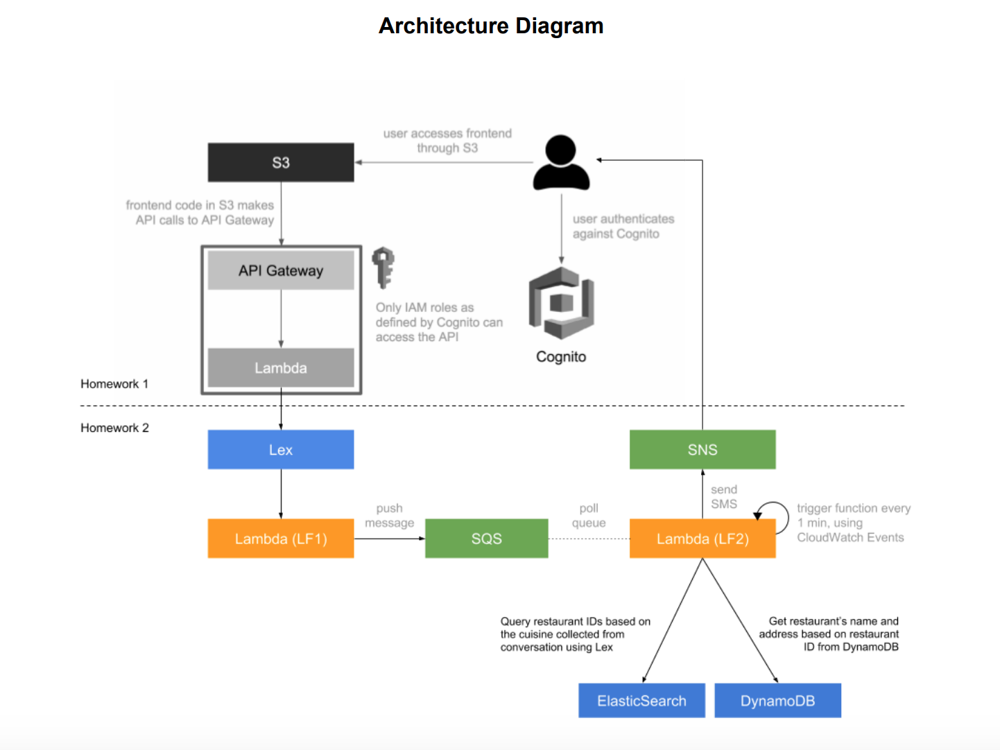
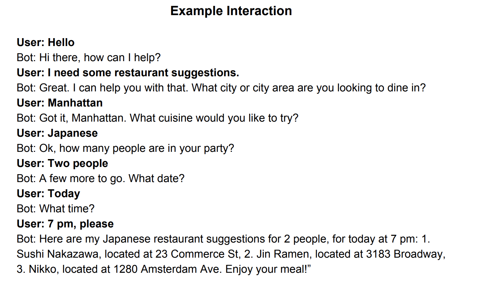

# Dining-Concierge-Chat-App
This is a serverless, micro service-driven web application created completely using AWS cloud services. The main application of this chatbot is to provide restaurant suggestions to its users based on the preferences provided to it through conversations.

We have support for Yelp-API with suggestions and real time chat. 

## Services Used
1. Amazon S3 - To host the frontend
2. Amazon Lex - To create the bot
3. API Gateway - To set up the API
4. Amazon SQS - to store user requests on a first-come bases
5. ElasticSearch Service - To quickly get restaurant ids based on the user preferences of cuisine collected from SQS
6. DynamoDB - To store the restaurant data collected using Yelp API
7. Amazon SNS - to send restaurant suggestions to users through SMS
8. Lambda - To send data from the frontend to API and API to Lex, validation, collecting restaurant data, sending suggestions using SNS.
9. Yelp API - To get suggestions for food
10. AWS Congito - For authentication

## Chat Architecture Diagram

## Chat Example

## Steps
1. Build and deploy the frontend of the application 

    a. Implement a chat user interface, where the user can write messages and get responses back. You can use open source libraries and frameworks that give you this UI and UX out of the box. 

    b. Host your frontend in an AWS S3 bucket
        i. Set the bucket up for website hosting
        ii. https://docs.aws.amazon.com/AmazonS3/latest/dev/HostingWebsiteOnS3Setup.html

2. Build the API for the application

    a. Use API Gateway to setup your API 

        i. use the following API/Swagger specification for your API 
            * https://github.com/001000001/aics-columbia-s2018/blob/master/aics-swagger.yaml
            * Use http://editor.swagger.io/ to visualize this file
            * You can import the Swagger file into API Gateway
            * https://docs.aws.amazon.com/apigateway/latest/developerguide/api-gateway-import-api.html
            * Create a Lambda function (LF0) that performs the chat operation
            * Use the request/response model (interfaces) specified in the API specification above

        ii. For now, just implement a boilerplate response to all messages:
            * ex. User says anything, Bot responds: "I’m still under development. Please come back later."

    b. Notes 

        i. You will need to enable CORS on your API methods 
            * https://docs.aws.amazon.com/apigateway/latest/developerguide/how-to-cors.html

        ii. API Gateway can generate an SDK for your API, which you can use in your frontend. It will take care of calling your API, as well as session signing the API calls -- an important security feature 
            * https://docs.aws.amazon.com/apigateway/latest/developerguide/how-to-generate-sdk-javascript.html

3. Build a Dining Concierge chatbot using Amazon Lex.

    a. Create a new bot using the Amazon Lex service. Read up the documentation on all things Lex, for more information: https://docs.aws.amazon.com/lex/latest/dg/getting-started.html 

    b. Create a Lambda function (LF1) and use it as a code hook for Lex, which
    essentially entails the invocation of your Lambda before Lex responds to
    any of your requests -- this gives you the chance to manipulate and
    validate parameters as well as format the bot’s responses. More
    documentation on Lambda code hooks at the following link:
    https://docs.aws.amazon.com/lex/latest/dg/using-lambda.html 

    c. Bot Requirements:

        i. Implement at least the following three intents: 
            * GreetingIntent
            * ThankYouIntent
            * DiningSuggestionsIntent

        ii. The implementation of an intent entails its setup in Amazon Lex as
        well as handling its response in the Lambda function code hook. 
            * Example: for the GreetingIntent you need to 
                1. create the intent in Lex, 
                2. train and test the intent in the Lex console, 
                3. implement the handler for the GreetingIntent in the Lambda code hook, such that when you receive a request for the GreetingIntent you compose a response such as “Hi there, how can I help?”

        iii. For the DiningSuggestionsIntent, you need to collect at least the following pieces of information from the user, through conversation:
            * Location
            * Cuisine
            * Dining Time
            * Number of people
            * Phone number

        iv. Based on the parameters collected from the user, push the information collected from the user (location, cuisine, etc.) to an
            SQS queue (Q1). More on SQS queues here:
            https://aws.amazon.com/sqs/

                *  Also confirm to the user that you received their request and
                    that you will notify them over SMS once you have the list of
                    restaurant suggestions.

4. Integrate the Lex chatbot into your chat API

    a. Use the AWS SDK to call your Lex chatbot from the API Lambda (LF0).

    b. When the API receives a request, you should 
        1. extract the text message from the API request, 
        2. send it to your Lex chatbot, 
        3. wait for the
        response, 
        4. send back the response from Lex as the API response.

5. Use the Yelp API to collect 5,000+ random restaurants from Manhattan.

    a. Use the following tools:

        i. Yelp API
            * Get restaurants by your self-defined cuisine types
            * You can do this by adding cuisine type in the search term ( ex. Term: chinese restaurants)
            * Each cuisine type should have 1,000 restaurants or so.
            * Make sure your restaurants don’t duplicate.

        ii. DynamoDB (a noSQL database)
            * Create a DynamoDB table and named “yelp-restaurants”
            * Store the restaurants you scrape, in DynamoDB (one thing you will notice is that some restaurants might have more or ess fields than others, which makes DynamoDB ideal for storing this data)
            * With each item you store, make sure to attach a key to the object named “insertedAtTimestamp” with the value of the time and date of when you inserted the particular record 
        * Store those that are necessary for your recommendation.(Requirements: Business ID, Name, Address, Coordinates, Number of Reviews, Rating, Zip Code)
    
        iii. Note: you can perform this scraping from your computer or from your AWS account -- your pick.

6. Create an ElasticSearch instance using the AWS ElasticSearch Service.
    - Create an ElasticSearch index called “restaurants”
    - Create an ElasticSearch type under the index “restaurants” called “Restaurant”
    - Store partial information for each restaurant scraped in ElasticSearch
        under the “restaurants” index, where each entry has a “Restaurant” data
        type. This data type will be of composite type stored as JSON in ElasticSearch.
        https://www.elastic.co/guide/en/elasticsearch/guide/current/mapping.html
    - You only need to store RestaurantID and Cuisine for each restaurant

7. Build a suggestions module, that is decoupled from the Lex chatbot.

    * Create a new Lambda function (LF2) that acts as a queue worker. Whenever it is invoked it 
        1. pulls a message from the SQS queue (Q1),  
        2. gets a random restaurant recommendation for the cuisine collected through conversation from ElasticSearch and DynamoDB, 
        3. formats them and 
        4. sends them over text message to the phone number included in the SQS message, using SNS (https://docs.aws.amazon.com/sns/latest/dg/SMSMessages.html). 
            i. Use the DynamoDB table “yelp-restaurants” (which you created
                from Step 1) to fetch more information about the restaurants
                (restaurant name, address, etc.), since the restaurants stored in
                ElasticSearch will have only a small subset of fields from each
                restaurant. 
            ii. Modify the rest of the LF2 function if necessary to send the user text/email.
    * Set up a CloudWatch event trigger that runs every minute and invokes the Lambda function as a result:
        https://docs.aws.amazon.com/AmazonCloudWatch/latest/events/RunLabdaSchedule.html. This automates the queue worker Lambda to poll                and process suggestion requests on its own.
